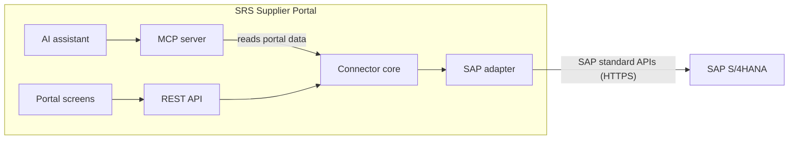

# SAP integration: research findings

---

## 1. Summary

- **All SAP steps in the spec are feasible** with SAP's standard APIs: reading suppliers, parts and requisitions, and creating the PO, inbound delivery, goods receipt and inspection decision.
- **Pulling data from SAP: tested and working** on the SAP sandbox (suppliers, purchase orders, products and requisitions; live data, HTTP 200).
- **Pushing data to SAP: not possible on the free sandbox.** SAP returns HTTP 405 (read-only). Testing pushes needs a real SAP system: SAP's 30-day trial (~3–4 USD per uptime hour plus a small monthly storage fee, roughly 10–20 USD per demo day) or a customer's test system.
- **Two steps need a small design change** to match how SAP works: invoice hold and stock release (section 7).
- **No extra SAP licence is needed** for the normal portal integration. SAP's paid MCP Gateway is only needed if the AI must call SAP directly.

---

## 2. How the portal connects to SAP

- All SAP calls go through one path: REST API → connector core → SAP adapter. This is the spec's design, and it fits SAP well.
- The AI reads the portal's own copy of SAP data, not SAP directly (needed because of SAP's API rules, section 8).
- Moving from mock SAP to real SAP only changes the SAP adapter.

---

## 3. Integration points

Following the workflow in spec §4:

**How each point was validated:** "Feasible" is checked against SAP's official API documentation. "Tested" means it was run live on the SAP sandbox. Writes can't run on the sandbox, so they're validated by documentation only until a real SAP system is available.

| # | Step | Direction | What happens in SAP | SAP API | Feasible? | Tested? |
|---|---|---|---|---|---|---|
| 1 | Sync suppliers | SAP → portal | Read suppliers and whether they're blocked | Business Partner (`API_BUSINESS_PARTNER`) | ✅ | ✅ Sandbox, live data |
| 2 | Sync parts and BOMs | SAP → portal | Read materials and bills of material | Product (`API_PRODUCT_SRV`), Bill of Material (`API_BILL_OF_MATERIAL_SRV`) | ✅ | ✅ Sandbox, live data (products). BOM: SAP offers no sandbox for this API ("No Sandbox" on api.sap.com), so documentation only |
| 3 | Sync open requisitions | SAP → portal | Read open purchase requisitions; flag any that changed | Purchase Requisition (`API_PURCHASEREQUISITION_2`, new v4) | ✅ | ✅ Sandbox, live data (tested with the v2 version the sandbox offers) |
| 4 | Request, quotes, messages | Portal only | Nothing (by design) | — | ✅ | No SAP involved |
| 5 | Buyer awards | Portal → SAP | Create the purchase order | Purchase Order (new v4) | ✅ | ❌ Write: sandbox blocks it (HTTP 405); needs the 30-day trial |
| 6 | Supplier ships | Portal → SAP | Create an inbound delivery for the PO | Inbound Delivery (`API_INBOUND_DELIVERY_SRV`) | ✅ | ❌ Write: needs the 30-day trial |
| 7 | Inspector records arrival | Portal → SAP | Goods receipt into quality inspection stock | Inbound Delivery (post goods receipt) or Material Document (`API_MATERIAL_DOCUMENT_SRV`) | ⚠️ Needs quality inspection set up in SAP | ❌ Write: needs the 30-day trial |
| 8 | Inspector approves / rejects | Portal → SAP | Inspection decision; SAP moves stock to available or blocked | Inspection Lot (`API_INSPECTIONLOT_SRV`) | ⚠️ Needs SAP settings; can't be undone | ❌ Write: needs the 30-day trial |
| 9 | Reject → invoice hold | Portal → SAP | SAP blocks the invoice itself when it arrives | No direct API | ⚠️ Design change (section 7) | — |
| 10 | Show ERP documents | SAP → portal | Read a PO, delivery or receipt by number | Same APIs as above | ✅ | ✅ Sandbox (purchase orders) |
| 11 | AI assistant | Portal only | AI reads portal data | Our MCP server | ✅ | ✅ Claude Desktop and Gemini (POC) |

**Later (phase 2):** automatic change detection via SAP business events needs SAP Event Mesh, a paid SAP BTP service.

**Systems around SAP (upstream / downstream):**

| System | Why it matters |
|---|---|
| SAP S/4HANA (cloud or on-premise) | The system we read from and write to |
| SAP ECC (older customers) | Older interfaces (BAPI/RFC); needs a small Java service (SAP JCo) |
| SAP Cloud Connector | Needed to reach an **on-premise** SAP from outside the customer's network |
| SAP MCP Gateway (Integration Suite) | Only if the AI must call SAP directly |
| SAP Business Network | Many SAP customers already send POs and invoices to suppliers here. We must agree per customer which channel is used, so suppliers don't get things twice |

---

## 4. Test results

| Test | Result | Proof |
|---|---|---|
| Read suppliers from the SAP sandbox | ✅ HTTP 200, live data | `Proof/01_sandbox_tryout_http200.png` |
| Read purchase orders | ✅ HTTP 200, live data | `Proof/03_tool_explorer_purchase_orders.png` |
| Read products | ✅ HTTP 200, 5 live records, ~0.7 s | `Proof/10_products_read.png` |
| Read purchase requisitions | ✅ HTTP 200, 5 live records, ~0.6 s | `Proof/11_requisitions_read.png` |
| Read bills of material | Not possible: api.sap.com lists the BOM API as "No Sandbox" | api.sap.com (Bills of Material API page) |
| AI (Claude Desktop, Gemini) answering from live SAP data via the MCP server | ✅ Correct answers | `Proof/04`, `Proof/07` |
| Write data (POST) on the SAP sandbox | ❌ HTTP 405: *"only supported for GET operations"* | `Proof/09_sandbox_write_blocked_405.png` |

---

## 5. SAP systems we can use

| Option | Read | Write | Cost | How to get it |
|---|---|---|---|---|
| **SAP sandbox** (api.sap.com) | ✅ | ❌ | Free | Free account → "Show API Key" (**used for the POC**) |
| **SAP S/4HANA 30-day trial** | ✅ | ✅ | Licence free for 30 days; **~3–4 USD per uptime hour plus a small monthly storage fee**, on our own AWS/Azure/Google account | SAP Cloud Appliance Library, about 1–2 hours to set up |
| **Customer test system** (practice copy of a customer's SAP) | ✅ | ✅ | No cost to us | Customer's SAP admin gives us a user, once we have a customer |

---

## 6. Pricing

| Item | Price | Needed for our portal? |
|---|---|---|
| SAP sandbox | **Free** | Yes, for read testing (in use) |
| SAP S/4HANA 30-day trial | SAP licence free; **~3–4 USD per uptime hour plus a small monthly storage fee** | Only to test writing data |
| Customer's own SAP S/4HANA | Customer's existing licence | Yes, the customer already has it |
| SAP Integration Suite – Starter | USD 1,735 / month | No: our portal calls SAP's APIs directly |
| SAP Integration Suite – Standard | USD 5,361 / month | No: our portal calls SAP's APIs directly |
| SAP Integration Suite – Premium (includes MCP Gateway) | **USD 29,459 / month** | Only if the AI must call SAP directly |
| SAP Event Mesh (BTP) | SAP quote (sold per GB, min. 3 months) | Only for phase 2 |

**Why Integration Suite isn't needed:** the portal's REST API and connector core call SAP's APIs with fixed code (create PO, read suppliers, and so on). That only needs the customer's normal SAP licence. SAP's MCP Gateway is only required if an AI is allowed to choose and call SAP APIs itself, live. Our design avoids that: the AI reads the portal's own copy of the data, so the whole integration works without it.

**What it means in practice:**
- **Today (POC):** USD 0 for SAP.
- **Testing writes on the trial:** about 10–20 USD per demo day; about 500–650 USD for a full month of weekday use. The system must be stopped when not in use, because it charges every hour it runs.
- **Customer go-live:** no extra SAP licence for the normal integration. The customer's SAP team does the setup (section 9).

---

## 7. Design changes needed

| What the spec / code does now | How SAP works | Change |
|---|---|---|
| The portal puts an **invoice hold** when goods are rejected | The supplier's invoice doesn't exist yet at that point. SAP blocks it automatically when it arrives (quality inspection setting) | The portal records the rejection and shows "invoice will be blocked". It doesn't set the hold itself |
| The code puts goods straight into **available or blocked stock** on the inspector's decision | SAP receives goods into **quality inspection stock** on arrival; the inspection decision then moves them | Post the goods receipt at **arrival**, and the decision at **approve/reject**. Update the mock SAP the same way |
| The code has **no requisition sync** | The spec starts from SAP requisitions | Add requisition sync, or agree that POs without a requisition are fine (SAP allows both) |

---

## 8. Rules and limits

- **SAP API Policy (April 2026):** AI that chooses and calls SAP APIs itself is only allowed through SAP-approved routes, like the MCP Gateway. So for a customer, the AI reads portal data. The POC calling the sandbox directly is fine for testing only.
- **Older Purchase Order and Purchase Requisition APIs are deprecated.** Use the new v4 versions.
- **The sandbox is read-only.** Write tests need the trial or a customer test system.
- **An inspection decision can't be undone in SAP.** Lock it in the portal after posting (the spec already says this).
- **SAP has no built-in duplicate protection.** Our connector core must make sure a retry never creates a second PO.

---

## 9. What we will need from a customer (once there is one)

1. Which SAP they run: S/4HANA cloud, S/4HANA on-premise, or ECC.
2. One technical user, with access to only the APIs in section 3.
3. Network access (on-premise needs SAP Cloud Connector).
4. Quality inspection set up for the materials we buy.
5. Invoice block on quality rejection switched on.
6. Company code, purchasing organisation and plant to use on POs.
7. Whether they already use SAP Business Network with these suppliers.
8. A test system before we touch their live system.

---

## 10. Open points (not blockers)

These are setup details to confirm on api.sap.com when we build the real adapter. None of them changes the feasibility result.

1. SAP setup IDs (communication scenarios) for the BOM, inbound delivery, goods receipt and inspection APIs.
2. Whether the new Purchase Order API accepts the requisition number when creating a PO (fallback: create the PO without it).
3. Which Integration Suite edition includes the MCP Gateway (only matters if the AI must call SAP directly).

---

## 11. Decision needed

To test **pushing** data (create PO, delivery, goods receipt) on a real SAP system, we need SAP's 30-day trial at ~3–4 USD per uptime hour plus a small monthly storage fee, on a company cloud account. **Approval is needed before setting it up.**

---

## Sources (SAP official)

- SAP Business Accelerator Hub (APIs and sandbox): https://api.sap.com
- SAP API Policy (April 2026): https://help.sap.com/doc/sap-api-policy/latest/en-US/API_Policy_latest.pdf
- Sandbox is read-only (SAP Learning): https://learning.sap.com/learning-journeys/develop-advanced-extensions-with-sap-cloud-sdk/odata-mock-service-for-business-partner-api-of-sap-s-4hana-cloud_fa6af720-e75f-44e0-84cd-5ffc5a7250b0
- SAP S/4HANA 30-day trial, ~3–4 USD per uptime hour plus small monthly storage fee: https://www.sap.com/cz/documents/2025/05/e0389287-077f-0010-bca6-c68f7e60039b.html
- SAP Integration Suite pricing: https://www.sap.com/products/technology-platform/integration-suite/pricing.html
- SAP Event Mesh: https://www.sap.com/products/technology-platform/event-mesh.html
- Purchase Order v2 deprecated: https://help.sap.com/docs/SAP_S4HANA_CLOUD/bb9f1469daf04bd894ab2167f8132a1a/acd2da57df6cc525e10000000a4450e5.html
- Purchase Requisition v2 deprecated (SAP blog): https://blogs.sap.com/t5/enterprise-resource-planning-blogs-by-sap/what-s-new-in-purchase-requisitions-sap-s-4hana-cloud-public-edition-2402/ba-p/13645464
- Quality inspection at goods receipt: https://learning.sap.com/learning-journeys/configuring-sap-s-4hana-quality-management/describing-quality-management-at-goods-receipt
- Inspection decision can't be undone: https://learning.sap.com/courses/applying-sap-s-4hana-quality-management/executing-a-usage-decision_ba2ea755-2e7f-47fc-9aa2-97ae90e8a5be
- Blocked invoices (quality block): https://learning.sap.com/courses/invoice-verification-in-sap-s-4hana/releasing-blocked-invoices-1
- AI access to SAP (SAP Architecture Center): https://architecture.learning.sap.com/docs/ref-arch/137800
- SAP Business Network: https://learning.sap.com/courses/discovering-native-integration-to-sap-business-network-for-sap-s-4hana-cloud-private-edition/introducing-source-to-pay-with-sap-business-network
