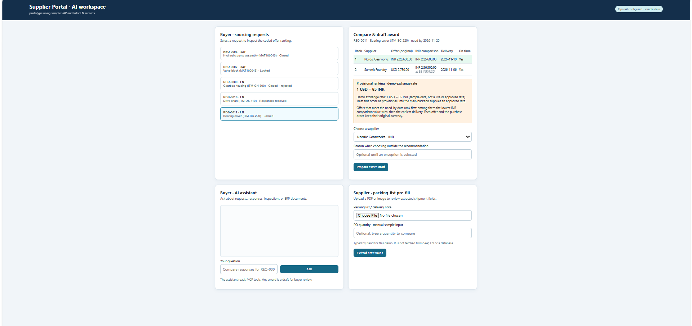

# SRS Supplier Portal · AI Slice 4 standalone demo

A self-contained demo of the portal's AI features: a buyer assistant over seven MCP tools, coded supplier ranking, draft-only award, and supplier packing-list pre-fill. The UI is **React 18 + TypeScript** (Vite) in `frontend/`; the backend is **FastAPI** in `web_app.py`.

It runs in **sample-data mode**: all records are fictional (`demo_data.py`) and are read through one data boundary, `portal_data.py`. It is **not** connected to the portal database, SAP / Infor LN connectors, authentication or a confirmation API, and it **cannot post a purchase order or shipment**. See [INTEGRATION.md](INTEGRATION.md) for what the team backend must connect.

In the team repository this prototype lives in `slice4-ai-prototype/`; run every command below from that folder.



*The AI workspace on sample data ([full-size screenshot](docs/screenshots/dashboard.png)).*

## Prerequisites

- Windows PowerShell
- [uv](https://docs.astral.sh/uv/) (installs Python 3.12 from `pyproject.toml` / `uv.lock`)
- Node.js 22+ and npm
- Optional: an OpenAI API key from the team, for buyer chat and PDF/image pre-fill

## Setup, build and run (PowerShell)

Run from the project root:

```powershell
# 1. Python dependencies
uv sync

# 2. Optional: AI key for chat and pre-fill (never commit .env)
Copy-Item .env.example .env
notepad .env          # set OPENAI_API_KEY=...

# 3. Build the React frontend (required before FastAPI can serve it)
cd frontend
npm ci
npm run build
cd ..

# 4. Start the backend + built frontend on port 8008
uv run uvicorn web_app:app --host 127.0.0.1 --port 8008
```

Open **http://127.0.0.1:8008**.

**The frontend must be built first.** FastAPI serves the files in `frontend/dist`; if that folder is missing, `/` returns *503 React frontend not built*. After editing React files, stop the server, run `cd frontend; npm run build; cd ..`, and start it again.

For live UI development, keep the backend running and in a second terminal run `cd frontend; npm run dev`, then open **http://127.0.0.1:5173** (Vite proxies `/api` to port 8008).

Sample prices are in INR and USD. Offers in different currencies are ranked in INR using a **demo exchange rate** (1 USD = 85 INR, sample data, not a live rate); set `DEMO_USD_INR_RATE` in `.env` to change it. The ranking is shown as provisional until the main backend supplies an approved rate.

Without a key, the request list, comparisons and award drafts work. Chat and pre-fill return a clear *OPENAI_API_KEY is not set* message. The default model is `gpt-4.1-mini`; set `OPENAI_MODEL` in `.env` to change it.

## Tests and checks (PowerShell)

```powershell
# Offline: 13 tool checks + unit tests (no API key, no network)
uv run python script.py check

# React type-check and production build
cd frontend; npm run build; cd ..

# Live (uses the OpenAI key): 10 fixed SRS prompts + 5 grounding prompts
uv run python script.py test

# Live packing-list pre-fill on the sample PDFs (--po-qty is typed-in sample input)
uv run python script.py prefill samples\packing_list_PUR000456.pdf --po-qty 30
uv run python script.py prefill samples\delivery_note_4500000123.pdf --po-qty 50

# Ask one question, or expose the MCP server on stdio
uv run python script.py ask "Compare the responses for REQ-0007."
uv run python script.py serve
```

`check` runs the offline checks in `test_prompts.py` and the unit tests in `test_award.py`, `test_grounding.py`, `test_accuracy.py` and `test_portal_data.py`. Any single file can be run with `uv run python -m unittest test_award -v`.

## Sample data

| Request | ERP | Status | Shows |
|---|---|---|---|
| `REQ-0007` | SAP | Locked | Ranked comparison, award draft, supplier-comment prompt injection |
| `REQ-0011` | LN | Locked | Offers in INR and USD: provisional ranking in INR at the demo rate 1 USD = 85 INR |
| `REQ-0010` | LN | Responses received | Not yet awardable |
| `REQ-0003` | SAP | Closed | Historical comparison, PO and goods receipt |
| `REQ-0009` | LN | Closed – rejected | Rejected shipment `SHP-0012`, inspection and invoice hold |

`samples/` holds two fictional PDFs (marked *DEMO DOCUMENT*): a complete packing list and a delivery note with a missing tracking number, a short shipment (48 of 50) and an injected instruction that extraction must ignore.

## Files

| File | Purpose |
|---|---|
| `portal_data.py` | **Data boundary**: read-only `PortalData` interface, `SampleData` implementation, `set_portal_data()` for the team backend |
| `demo_data.py` | Fictional SAP/LN-shaped records; read only by `SampleData` |
| `mcp_server.py` | Five read tools and two draft-only tools |
| `ranking.py` | Offer ranking in code; mixed currencies are not ranked |
| `assistant.py` | OpenAI function-call loop over the MCP tools |
| `grounding.py` | Code-enforced grounding of assistant answers |
| `prefill.py` | OpenAI PDF/image extraction into a supplier-review draft |
| `web_app.py` | FastAPI endpoints; serves the built frontend; no ERP write endpoints |
| `settings.py` | Reads `.env` (`OPENAI_API_KEY`, `OPENAI_MODEL`, `AI_REQUEST_TIMEOUT_SECONDS`) |
| `script.py` | Command-line entry point (`check`, `test`, `ask`, `chat`, `prefill`, `serve`) |
| `frontend/` | React 18 + TypeScript screen (`src/App.tsx`, types in `src/api.ts`) |
| `test_prompts.py` | 13 offline checks; 10 live SRS prompts and 5 live grounding prompts |
| `test_award.py`, `test_grounding.py`, `test_accuracy.py`, `test_portal_data.py` | Offline unit tests |
| `samples/` | Fictional packing-list PDFs for pre-fill |
| `docs/screenshots/` | Screenshot of the AI workspace used in this README |
| `API_REFERENCE.md` | Exact inputs and outputs of every tool and endpoint |
| `INTEGRATION.md` | Data boundary, and where auth, roles, confirmation, ERP writes, idempotency and logging belong |
| `FINDINGS.md` | Data flow and current state |

## Sharing through Git

`.gitignore` excludes `.env`, `.venv/`, `frontend/node_modules/`, `frontend/dist/`, `out/`, caches and build info. Keep source, `uv.lock`, `frontend/package-lock.json`, `samples/`, tests and docs. `.env.example` has placeholders only. `.gitignore` does not apply to ZIP files; exclude the same folders by hand when zipping.
